

0Journal Articles

0Book Chapter

<a class="pub-scholar" href="https://scholar.google.com/citations?user=eE9rDfkAAAAJ" target="_blank" rel="noopener" aria-label="Google Scholar profile"><i class="bi bi-mortarboard-fill"></i></a>

## Journal Articles

### 2025

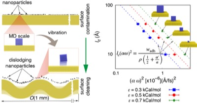

[20] **Contaminant Removal Using Vibrating Surfaces: Nanoscale Insights and a Universal Scaling Law**
<u>Pillai R</u>, Neilan D, Handel C, Datta S
<a href="https://pubs.acs.org/journal/nalefd"><em>Nano Letters</em></a> 25, 4284–4290 (2025) | [DOI](https://doi.org/10.1021/acs.nanolett.4c05973) | [Data](https://datashare.ed.ac.uk/handle/10283/8949)

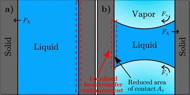

[19] **Spectral mechanisms of solid/liquid interfacial heat transfer in the presence of a meniscus**
El-Rifai A, Klochko L, Mandrolko V, Perumanath S, Lacroix D, <u>Pillai R</u>, Isaiev M
<a href="https://www.rsc.org/journals-books-databases/about-journals/pccp/"><em>Physical Chemistry Chemical Physics</em></a> 27, 10185–10197 (2025) | [DOI](https://doi.org/10.1039/D4CP04768K)

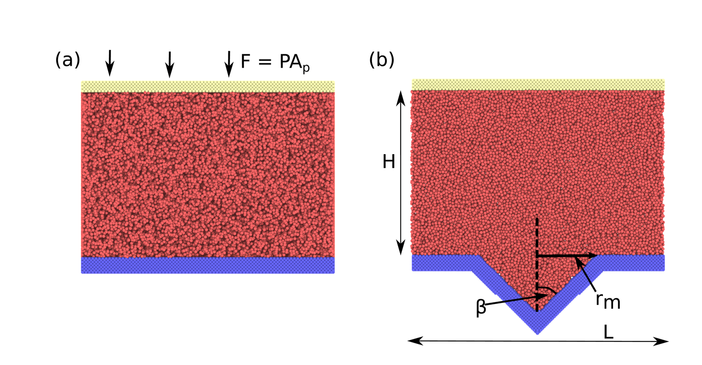

[18] **Nanoscale surface effects on heterogeneous vapor bubble nucleation**
Sullivan P, Dockar D, <u>Pillai R</u>
<a href="https://pubs.aip.org/aip/jcp"><em>The Journal of Chemical Physics</em></a> 162, 184501 (2025) | [DOI](https://doi.org/10.1063/5.0259208) | [Data](https://collections.durham.ac.uk/files/r1mc87pq34z)

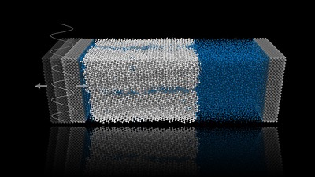

[17] **Nanoscale insights into vibration-induced heterogeneous ice nucleation**
Chen P, <u>Pillai R</u>, Datta S
<a href="https://www.rsc.org/journals-books-databases/about-journals/nanoscale/"><em>Nanoscale</em></a> 17, 14172 (2025) | [DOI](https://doi.org/10.1039/D5NR00326A) | [Data](https://datashare.ed.ac.uk/handle/10283/9012)

### 2024

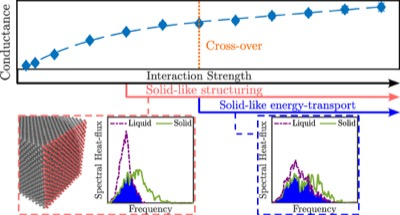

[16] **Unraveling the Regimes of Interfacial Thermal Conductance at a Solid/Liquid Interface**
El-Rifai A, Perumanath S, Borg MK, <u>Pillai R</u>
<a href="https://pubs.acs.org/journal/jpccck"><em>The Journal of Physical Chemistry C</em></a> 128, 8408–8417 (2024) | [DOI](https://doi.org/10.1021/acs.jpcc.4c00536) | [Data](https://datashare.ed.ac.uk/handle/10283/8772)

### 2023

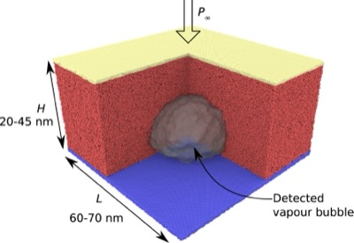

[15] **The role of surface wettability on the growth of vapour bubbles**
Sullivan P, Dockar D, Enright R, Borg MK, <u>Pillai R</u>
<a href="https://www.sciencedirect.com/journal/international-journal-of-heat-and-mass-transfer"><em>International Journal of Heat and Mass Transfer</em></a> 217, 124657 (2023) | [DOI](https://doi.org/10.1016/j.ijheatmasstransfer.2023.124657) | [Data](https://datashare.ed.ac.uk/handle/10283/8529)

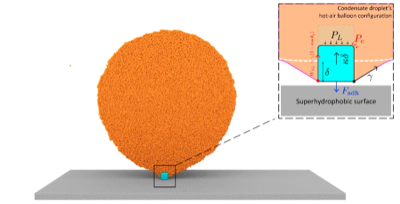

[14] **Rolling and Sliding Modes of Nanodroplet Spreading: Molecular Simulations and a Continuum Approach**
Perumanath S, Chubynsky MV, <u>Pillai R</u>, Borg MK, Sprittles JE
<a href="https://journals.aps.org/prl/"><em>Physical Review Letters</em></a> 131, 164001 (2023) | [DOI](https://doi.org/10.1103/PhysRevLett.131.164001) | [Data](https://datashare.ed.ac.uk/handle/10283/8535)

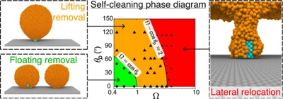

[13] **Contaminant Removal from Nature's Self-Cleaning Surfaces**
Perumanath S, <u>Pillai R</u>, Borg MK
<a href="https://pubs.acs.org/journal/nalefd"><em>Nano Letters</em></a> 23, 4234–4241 (2023) | [DOI](https://doi.org/10.1021/acs.nanolett.3c00257) | [Data](https://datashare.ed.ac.uk/handle/10283/4860)

### 2022

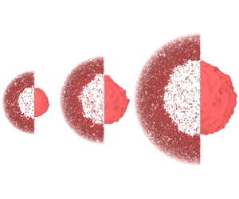

[12] **Inertio-thermal vapour bubble growth**
Sullivan P, Dockar D, Borg MK, Enright R, <u>Pillai R</u>
<a href="https://www.cambridge.org/core/journals/journal-of-fluid-mechanics"><em>Journal of Fluid Mechanics</em></a> 948, A55 (2022) | [DOI](https://doi.org/10.1017/jfm.2022.734) | [Data](https://datashare.ed.ac.uk/handle/10283/4489)

### 2021

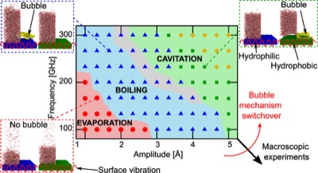

[11] **Acoustothermal Nucleation of Surface Nanobubbles**
Datta S, <u>Pillai R</u>, Borg MK, Sefiane K
<a href="https://pubs.acs.org/journal/nalefd"><em>Nano Letters</em></a> 21, 1267–1273 (2021) | [DOI](https://doi.org/10.1021/acs.nanolett.0c03895)

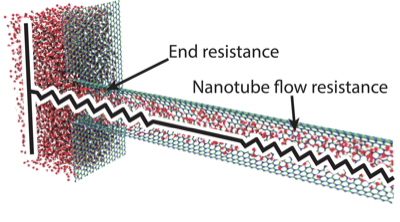

[10] **Untangling the physics of water transport in boron nitride nanotubes**
Mistry S, <u>Pillai R</u>, Mattia D, Borg MK
<a href="https://www.rsc.org/journals-books-databases/about-journals/nanoscale/"><em>Nanoscale</em></a> 13, 18096–18102 (2021) | [DOI](https://doi.org/10.1039/D1NR04794A) | [Data](https://datashare.ed.ac.uk/handle/10283/4042)

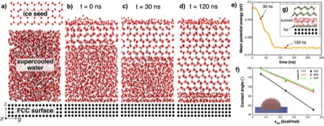

[9] **Impact of surface nanostructure and wettability on interfacial ice physics**
Nikiforidis V-M, Datta S, Borg MK, <u>Pillai R</u>
<a href="https://pubs.aip.org/aip/jcp"><em>The Journal of Chemical Physics</em></a> 155, 234307 (2021) | [DOI](https://doi.org/10.1063/5.0069896) | [Data](https://datashare.ed.ac.uk/handle/10283/4129)

### 2020

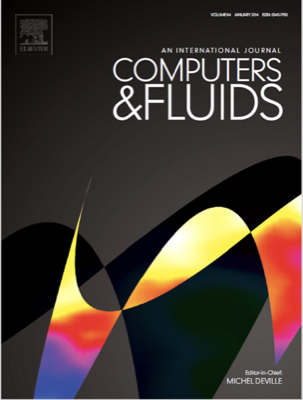

[8] **Coupling Molecular Dynamics and Direct Simulation Monte Carlo using a general and high-performance code coupling library**
Longshaw SL, Emerson DR, <u>Pillai R</u>, Gibelli L, Lockerby DA
<a href="https://www.sciencedirect.com/journal/computers-and-fluids"><em>Computers &amp; Fluids</em></a> 213, 104726 (2020) | [DOI](https://doi.org/10.1016/j.compfluid.2020.104726)

### 2018

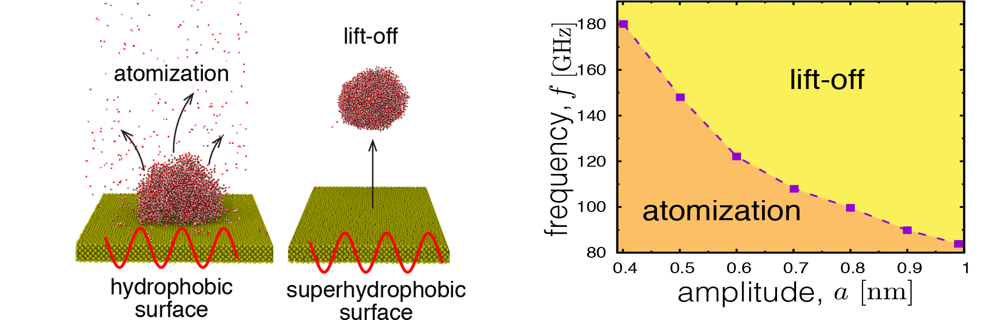

[7] **Dynamics of Nanodroplets on Vibrating Surfaces**
<u>Pillai R</u>, Borg MK, Reese JM
<a href="https://pubs.acs.org/journal/langd5"><em>Langmuir</em></a> 34, 11898–11904 (2018) | [DOI](https://doi.org/10.1021/acs.langmuir.8b02066) | [Data](https://datashare.ed.ac.uk/handle/10283/3176)

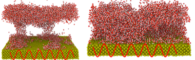

[6] **Acoustothermal Atomization of Water Nanofilms**
<u>Pillai R</u>, Borg MK, Reese JM
<a href="https://journals.aps.org/prl/"><em>Physical Review Letters</em></a> 121, 104502 (2018) | [DOI](https://doi.org/10.1103/PhysRevLett.121.104502) | [Data](https://datashare.ed.ac.uk/handle/10283/3157)

### 2017

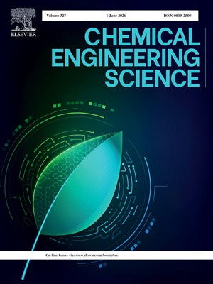

[5] **Electrophoretically mediated partial coalescence of a charged microdrop**
<u>Pillai R</u>, Berry JD, Harvie DJE, Davidson MR
<a href="https://www.sciencedirect.com/journal/chemical-engineering-science"><em>Chemical Engineering Science</em></a> 169, 28–45 (2017) | [DOI](https://doi.org/10.1016/j.ces.2016.07.048)

### 2016

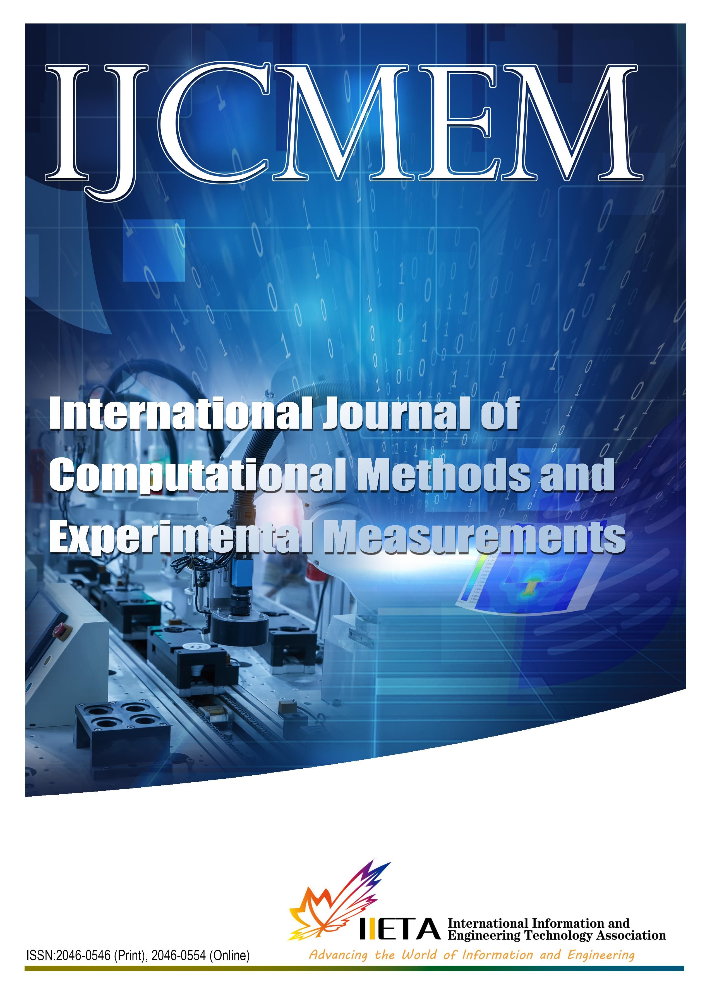

[4] **Electrohydrodynamic Deformation and Interaction of Microscale Drop Pairs**
<u>Pillai R</u>, Berry JD, Harvie DJE, Davidson MR
<a href="https://www.iieta.org/Journals/IJCMEM"><em>International Journal of Computational Methods and Experimental Measurements</em></a> 4, 33–41 (2016) | [DOI](https://doi.org/10.2495/CMEM-V4-N1-33-41)

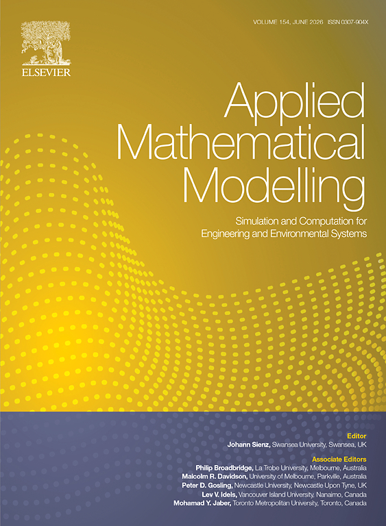

[3] **Numerical simulation of two-fluid flow of electrolyte solution with charged deforming interfaces**
Davidson MR, Berry JD, <u>Pillai R</u>, Harvie DJE
<a href="https://www.sciencedirect.com/journal/applied-mathematical-modelling"><em>Applied Mathematical Modelling</em></a> 40, 1989–2001 (2016) | [DOI](https://doi.org/10.1016/j.apm.2015.09.021)

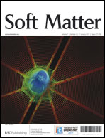

[2] **Electrokinetics of isolated electrified drops**
<u>Pillai R</u>, Berry JD, Harvie DJE, Davidson MR
<a href="https://www.rsc.org/journals-books-databases/about-journals/soft-matter/"><em>Soft Matter</em></a> 12, 3310–3325 (2016) | [DOI](https://doi.org/10.1039/C6SM00047A)

### 2015

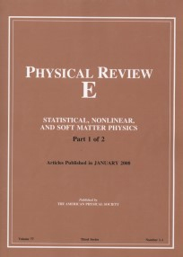

[1] **Electrolytic drops in an electric field: A numerical study of drop deformation and breakup**
<u>Pillai R</u>, Berry JD, Harvie DJE, Davidson MR
<a href="https://journals.aps.org/pre/"><em>Physical Review E</em></a> 92, 013007 (2015) | [DOI](https://doi.org/10.1103/PhysRevE.92.013007)

---

## Book Chapters

**On the Development of Icephobic Surfaces: Bridging Experiments and Simulations**
Tagliaro I, Cerpelloni A, Nikiforidis VM, <u>Pillai R</u>, Antonini C
In: Marengo M, De Coninck J (eds) *The Surface Wettability Effect on Phase Change*, Springer, Cham, pp. 235–272 (2022) | [DOI](https://doi.org/10.1007/978-3-030-82992-6_8)

---

## Thesis

**Stretching, bursting, splashing and bouncing: Electrohydrodynamics of microfluidic drops**
<u>Pillai R</u>
PhD Thesis, University of Melbourne (2017)
